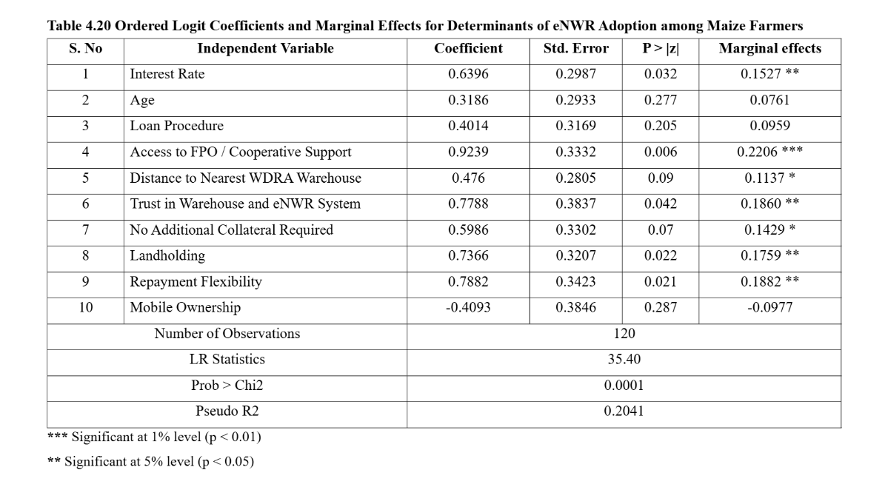

# Determinants of Farmer Adoption of eNWR System

### Ordered Logit Regression Analysis

---

## Project Overview

This project analyzes the **factors influencing farmer adoption of the Electronic Negotiable Warehouse Receipt (eNWR) system** using an **Ordered Logit Regression Model**.

The eNWR system allows farmers to store agricultural produce in certified warehouses and obtain credit against warehouse receipts. Understanding the determinants of adoption helps policymakers and financial institutions design better agricultural financing mechanisms.

This project applies econometric modeling to survey data to identify the **key socio-economic and institutional factors affecting adoption behavior**.

---

## Dataset

The dataset contains **survey responses from maize farmers**.

**Sample size:**
120 farmers

### Variables Used

| Variable                  | Description                            |
| ------------------------- | -------------------------------------- |
| Interest Rate             | Interest rate charged on loans         |
| Age                       | Age of the farmer                      |
| Loan Procedure            | Complexity of loan application         |
| Access to FPO/Cooperative | Institutional support availability     |
| Distance to Warehouse     | Distance to nearest warehouse          |
| Trust in Warehouse System | Farmer confidence in warehouse system  |
| No Additional Collateral  | Availability of collateral-free loans  |
| Landholding               | Size of land owned by the farmer       |
| Repayment Flexibility     | Flexibility of loan repayment          |
| Mobile Ownership          | Whether the farmer owns a mobile phone |

---

## Methodology

The study uses an **Ordered Logit Model** to estimate the probability that farmers adopt the eNWR system.

### Model Specification

Adoption decision is modeled as:

Adoption = f(interest_rate, age, loan_procedure, cooperative_support, distance_to_warehouse, trust_in_system, collateral_requirement, landholding, repayment_flexibility, mobile_ownership)

The ordered logit model is appropriate when the dependent variable represents **ordered categories of adoption behavior**.

---

## Regression Results



### Model Statistics

| Statistic    | Value  |
| ------------ | ------ |
| Observations | 120    |
| LR Chi²      | 35.40  |
| Prob > Chi²  | 0.0001 |
| Pseudo R²    | 0.204  |

The model is statistically significant, indicating that the explanatory variables collectively influence farmer adoption behavior.

---

## Key Findings

### Institutional Support Encourages Adoption

Access to **Farmer Producer Organizations (FPOs) or cooperatives** significantly increases the likelihood of farmers adopting the eNWR system.

### Trust in Warehouse Systems Matters

Farmers who trust warehouse storage systems are more likely to participate in warehouse receipt financing.

### Farm Size Influences Adoption

Farmers with **larger landholdings** show a higher probability of adopting the system.

### Flexible Repayment Improves Participation

Loan repayment flexibility positively influences adoption decisions.

---

## Policy Implications

The results suggest that improving **institutional support, awareness, and trust in warehouse systems** can significantly increase adoption of warehouse receipt financing.

Policy recommendations include:

* Strengthening Farmer Producer Organizations
* Improving accessibility of warehouse infrastructure
* Promoting financial literacy among farmers
* Increasing awareness of warehouse receipt financing

---

## Tools Used

* **Stata**
* Ordered Logit Regression
* Econometric Modeling
* Survey Data Analysis

---

## Repository Structure
```
farmer-enwr-adoption-logit-model
│
├── farmer_adoption_data.csv
├── farmer_adoption_data.xlsx
├── ordered_logit_analysis.do
├── ordered_logit_results.png
└── README.md
```

## Author

**Kiran Jala**
MBA Agribusiness Management

Areas of Interest:

* Agricultural market analysis
* Econometric modeling
* Commodity price analytics
* Agricultural finance
